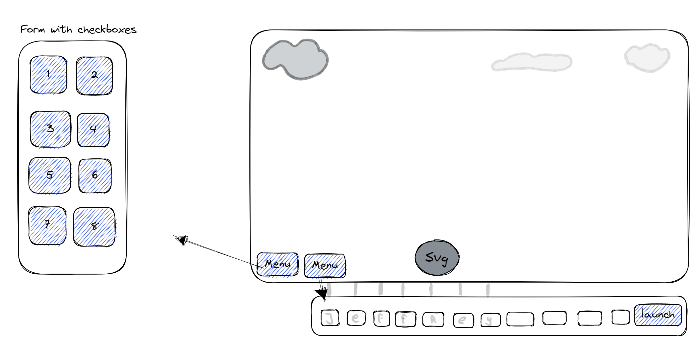
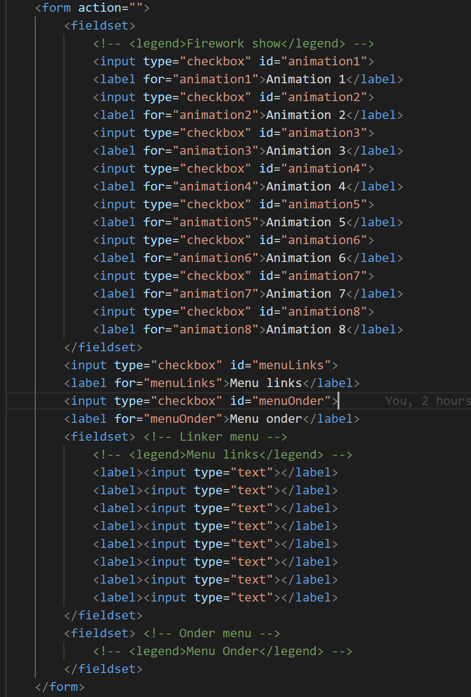
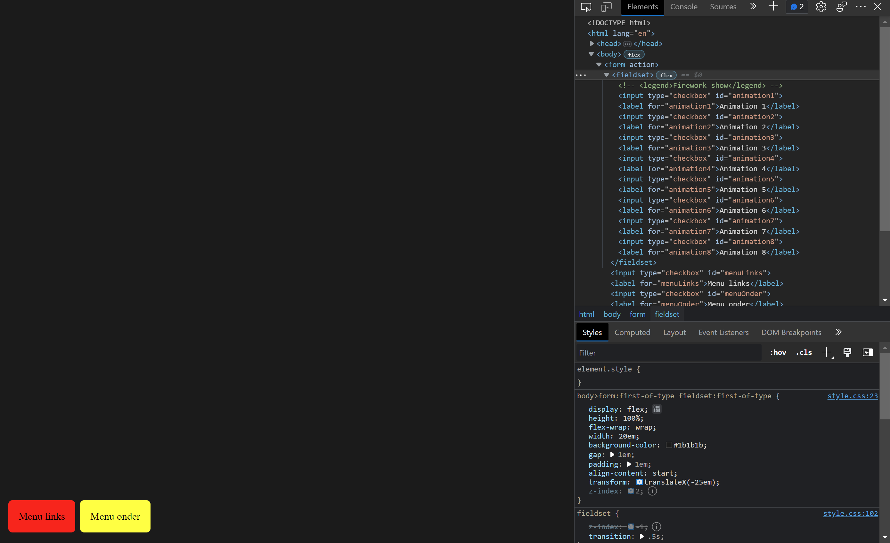
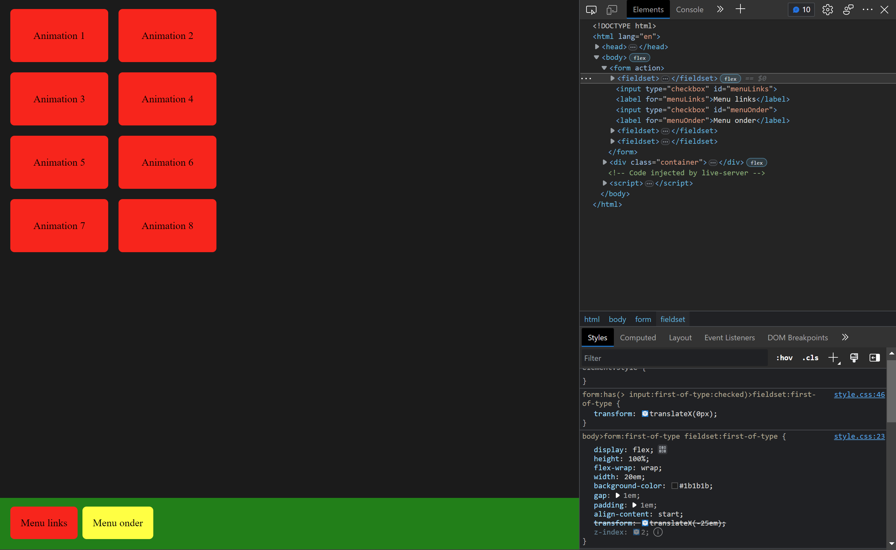
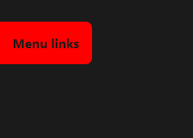
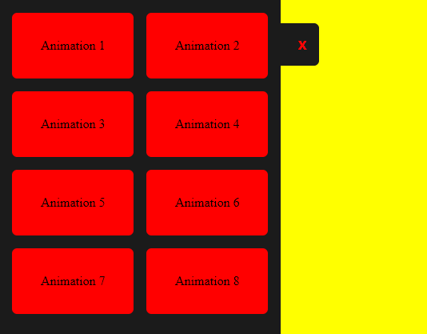
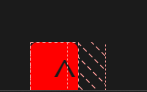

# FireworkCssOnly

## Assignement
The assignment is to make a firework animation with only CSS. The animations should be triggered by checkboxes. The animation should be responsive and work on mobile devices. It should be possible to add multiple fireworks at the same time. 

## Demo
[Firework show (gekkeboyjeff.github.io)](https://gekkeboyjeff.github.io/FireworkCssOnly/)

## Features
- [ ] Responsive
- [ ] Mobile friendly
- [ ] Multiple fireworks at the same time
- [ ] Animation triggered by checkboxes
- [ ] Animation triggered by hover
- [ ] Animation triggered by touch (for the hover preview)
- [ ] Animation triggered by focus

## Bronnen

## Week 1 planning
- [x] uittekenen hoe ik het ontwerp wil maken
- [x] Een uitschuifbaar menu maken
- [ ] Een werkende vuurpijl maken

This week it was my intention to make a basis for the assignment. Unfortunately, not everything worked out.

### Sketches:
I started drawing out my menu which came out like this


I moestly designed the UI with this sketch. It occurred to me that I should have a form with a number of fieldsets. As indicated above, the foldable menus are the field sets.

The basic HTML I was able to get out from my sketch for this week is as follows
The input fields in the middle (of the image above) are for sliding the field sets in and out.

### Css
For the base I have not yet taken into account the final styling because I still want to determine that.


As shown above, you can press both labels to slide out the menus. The "buttons" in the menu on the left have not been further developed yet.

### Feedback week 1
During the feedback conversation it came up that I used the has selector perfectly to make this. Below you see an image of the css selector in which I place the menu at the location on the left.


#### Takeaways
- Continue with your assignment. Speed it up a bit because you don't have flares and explosions yet. 
- I can eventually make something of a gallery of different firecrackers that become visible when I press another button. This can also be my process book at the same time.


## Start week 2
This week I'll continue with my takeaways from last week, the plan is to add the firecracker animation and add the explosion in multiple ways. I also have to add the textboxes on the bottom as shown in the layout sketch in week 1.

- [ ] Add a firecracker
- [ ] Add the animation to make it fly upwards
- [ ] Add the explosion
- [ ] Make the layout prettier
- [ ] Add a background
- [ ] Add layered backgrounds

### Lesson on custom properties

Custom properties are interesting for experimentation and architecture.

```CSS
/* Old custom properties */

button{
	color:teal;
	border-color:currentcolor;
}
button[type="submit"]{
	color:rebeccapurple
}
button[type="reset"]{
	color: saddlebrown;
}
```

The example above uses the colors already defined from css. That also works as a kind of variable.

```CSS
/* with recent custom properties */

button{
--button-color:teal;

	color:var(--button-color);
	border-color:var(--button-color);
}
button[type="submit"]{
	color:white
	background-color:var(--button-color);
}
button[type="reset"]{
	color: saddlebrown;
}
button:hover{
	--button-color: deeppink;
}
```

Above you can see that there are no variables defined in the root but rather in the components themselves. Sanne wanted to make it clear that it is also possible to update them within different components..

```CSS
The fun fact about variables is that you can add a fallback to them if the color does not work

button{
	background-color:(--button-color, red)
	}

A nice use case for this is adding a fallback in advance. Every list item has a standard delay of zero seconds unless the delay variable has been set.

li{
	animation-delay:var(--delay, 0s)
}

li:nth-of-type(2){
	--delay:2s;
}
li:nth-of-type(3){
	--delay:.5s;
}
```

**Unitless custom properties**
'``Lea verou' has an article coverin this. You want to do this for changing the animation based on how long something takes.

[cust props - more with calc - start (codepen.io)](https://codepen.io/GekkeBoyJeff/pen/eYLZeaL)

### Responsiveness
Since the buttons on the bottom left were both placed in an absolute position there was not much I could do to make it responsive. 
- I could make a media query to set them at another location to make them 'responsive'  
I did try this out but I was not happy with the result. I wanted the buttons to make sense for being at a certain position.

So I thought of a different way in which I could place them in my HTML file to make them responsive without having to add media queries.

So instead of placing them directly in the form. I placed them in the fieldset where they belonged. Then I positioned them with position relative. to give them a bit more of default 'responsiveness' which I tweaked a bit to my liking.

However, I now had a button which said 'Menu left' 

which I did not like. I also wanted to change the text of the button when it was pressed but since I wasn't allowed to use javascript I had to think of a different way or option.

It took me a while to figure out how to change the text but I found out I could change the text of 'content' which resides in the before and after tag. So I made this work.




#### Positioning the left button
```CSS
/* Left side button */
/* Because it is relative, it is directly in the middle, hence top -23.7em */
body>form:first-of-type fieldset:first-of-type label:first-of-type {
    position: relative;
    order: 1;
    top: -23.7em;
    padding: 0;
    flex: unset;
    left: 18em;
    width: 11em;
    background-color: unset;
    color: transparent;
    text-align: right;
}

/* Resizes the label and allows you to click through it */
form:has(> fieldset:first-of-type > input:first-of-type:checked)>fieldset:first-of-type>label:first-of-type {
    pointer-events: none;
    height: 3.3em;
    background-color: #1b1b1b;
    z-index: -1;
    width: 9em;
    left: 15em;
}
```

##### Changing the button on click
```CSS
/* Move the after 'button' to the top left and set the text to Firework */
body>form:first-of-type fieldset:first-of-type label:first-of-type::before {
    content: 'Firework';
    background-color: red;
    color: #1b1b1b;
    font-family: system-ui;
    font-weight: 700;
    padding: 1em;
    position: absolute;
    border-radius: 0 .5em .5em 0;
    left: 0em;
    pointer-events: all;
    transform: translateX(6em);
    transition: 1s;
    z-index: -6;
}

/* location and size of the expand button changes. This button is the styling for the expand button */
/* Also changes the text to an X */
body>form:has(> fieldset:first-of-type > input:first-of-type:checked)>fieldset:first-of-type label:first-of-type::before {
    content: 'X';
    color: red;
    background-color: #1b1b1b;
    transform: translateX(3em);
    transition: .5s;
    width: 8em;
    left: -4em;
}
```

#### Positioning the bottom menu and button
The menu on the bottom of the screen was done in a similar way, except I did not need to change the ::after selector. I could simply rotate it.

```CSS
/* hide the menu down by default */
form:has(>fieldset:nth-of-type(2)>input:first-of-type:checked)>fieldset:nth-of-type(2) {
    transform: translateY(0em);
} 

/* Change text in the label by placing the after */
form>fieldset:nth-of-type(2)>label:first-of-type::after {
    content: '^';
    color: #1b1b1b;
    font-weight: bold;
    font-size: 3em;
    position: relative;
    top: .2em;
    transition: .5s;
    order: -1;
    margin-left: .2em;
}
```

However, getting the arrow at the bottom to look well was a big tougher. Since I used another method for changin the button on the left I had to think of a way to make this look good aswell.
The difference between the top-left button and the one on the bottom is that the one on the top-left is hiding it's button and actually shows it's ::before element which is also clickable. I made the button itself click-through with pointer-events:none;

The button at the bottom simply has the same text-color as the background and has the bottom positioned with left:-.55em; to put it over the text. This however was not ideal since on mobile it would look like so:


It took me a while to figure out that it was better if I either made a ::before element of it or used order:-1; I did not know you could change the order of an element with a minus value. This was good to know.

After adding the order and removing the left property I added a flip once it has been pressed. it was the easiest way to animate this button. I did rotate the text in the after element at first but that didnt rotate through the center but rather through the right and it did not look pretty. so I changed it to a minus scale to rather flip it. which I think is better for a menu which goes up and down.

```CSS
/* Animation for flipping the arrow */
form:has(>fieldset:nth-of-type(2)>input:first-of-type:checked)>fieldset:nth-of-type(2)>label:first-of-type::after {
    top: -0.1em;
    transform-origin: .28em;
    transform: scaleY(-1);
}
```

After adding the slider buttons I added functionality for the other animation buttons. 

```CSS
form:has(> fieldset:first-of-type > input:nth-of-type(3):checked)>fieldset:nth-of-type(4) {
    background-color: brown;
    transform: translateY(-100%);
}

form>fieldset:nth-of-type(n+4) {
    position: absolute;
    width: 100vw;
    top: 100%;
}
```

the first selector is for a fieldset once the checkbox has been checked. I repeated multiple times for each animation.

### Animation
So I started working on my first animation. I want them to play once the checkbox has been pressed in the left menu.

A few days ago Sanne gave us a lesson about animation. I decided that I would use that animation for a base.
The HTML consisted out of:

```HTML
<div>
  <div></div>
  <div></div>
</div>
```

```CSS
body{
height:100vh;
display:grid;
place-content:center;
}

body div {
  width:5em;
  aspect-ratio:1;
  background-color:green;
  
  animation-name:omhoog;
  animation-duration:2s;
  animation-fill-mode:forwards;
  animation-play-state:paused;
  position:relative;
} 

@keyframes omhoog{
  0%{
    transform:translateY(0);
  }
  50%, 100%{
    transform:translateY(-200%);
  }
}

div div  {
  position:absolute;
  inset:0;
  background-color:red;
}

div div:nth-of-type(1){
  animation-name:links;
  animation-duration:1s;
  animation-delay:1s;
/*   animation-iteration-count:infinite; */
  animation-play-state:paused;
  animation-fill-mode:forwards;
}

div div:nth-of-type(2){
  animation-name:rechts;
  animation-duration:1s;
  animation-delay:1s;
/*   animation-iteration-count:infinite; */
    animation-fill-mode:forwards;
  animation-play-state:paused;
}

@keyframes links{
0%{
	transform:translateX(0%);
}
100%{
	transform:translateX(-200%);
  }
}
@keyframes rechts{
0%{
	transform:translateX(0%);
}
100%{
transform:translateX(200%);
  }
}
  
body:hover div{
  animation-play-state: running;
}
```

The code above shows a single red block which splits into three blocks.
 

So I tried to chain animations by placing a div around them which starts all the animations on hover. This however did not work fluently and felt wrong. After trying to make it work for a while a classmate told me I could simply place the other animation in the same css property and that I could add a delay for it aswell. 

So all I had to do was add the new animation
```CSS
@keyframes dissapear{
  0%{
    opacity:1;
  }100%{
    opacity:0;
  }
}

body div {
  width:5em;
  aspect-ratio:1;
  background-color:green;
  
  animation-name:omhoog, dissapear;
  animation-duration:2s, 1s;
  animation-delay:0s, 1.5s;
  animation-fill-mode:forwards;
  animation-play-state:paused;
  position:relative;
} 
```

As shown above, the animation-name has 2 properties now. the same goes for duration and delay so each animation has its sperate duration and starts at a different time.

