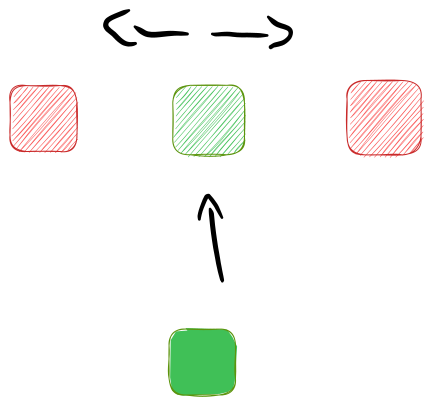

**(Meerdere) animaties maken doe je met een @keyframe**

Snap svg path: https://mavo.io/demos/svgpath/
animation-timing-function: www.matthewlein.com/tools/ceaser
uitgewerkte animation chain voorbeeld: https://codepen.io/GekkeBoyJeff/pen/bGxNbBq?editors=1100

**Hoe maak je een animatie?**
```HTML
<body>
	<div>
	</div>
</body>
```

```CSS
body{
height:100vh;
display:grid;
place-content:center
}
div{
width:5em;
aspect-ratio:1;
background-color:red;

animation-name:kleur, draai; /* Als je 2 properties meegeeft worden ze beide tegelijkertijd uitgevoerd */
animation-duration:1s, 2s;
animation-iteration-count:infinite;
animation-direction:alternate; /* van groen naar rood en rood naar groen 
// je kan de animation-directions ook combineren (bv alternate, normal) */
animation-play-state: running;
animation-timing-function:ease; /* elke keer snel beginnen en rustig eindigen */
animation-timing-function:linear; /* hierdoor draait het aan een stuk door */
/* dit zelf programmeren kan via www.matthewlein.com/tools/ceaser
 die genereert de transitie cubic-bezier(0,470, 1.550, 0.800, 1.550); */
}
div:hover{
animation-play-state: paused; /* De animatie pauzeren */
}

@keyframes kleur{
0%{
	background-color:red;
}
100%{
	background-color:green;
}
@keyframes draai{
0%{
	transform:rotate(0turn)
}
100%{
	transform:rotate(1turn)
}

}
```
De code hierboven maakt 1 blokje aan in een div die van rood naar groen gaat en weer terug.


**Chaining van animaties** 
```HTML
<div>
  <div></div>
  <div></div>
</div>
```

```CSS
body{
height:100vh;
display:grid;
place-content:center;
}

body > div{
  width:5em;
  aspect-ratio:1;
  background-color:green;
  
  animation-name:omhoog;
  animation-duration:2s;
	animation-fill-mode:forwards;
  animation-play-state:paused;
  
  position:relative;
} 

@keyframes omhoog{
  0%{
    transform:translateY(0);
  }
  50%, 100%{
    transform:translateY(-200%);
  }
}

div div{
  position:absolute;
  inset:0;
  background-color:red;
}

div div:nth-of-type(1){
  animation-name:links;
  animation-duration:1s;
  animation-delay:1s;
/*   animation-iteration-count:infinite; */
  animation-play-state:paused;
  animation-fill-mode:forwards;
}
div div:nth-of-type(2){
  animation-name:rechts;
  animation-duration:1s;
  animation-delay:1s;
/*   animation-iteration-count:infinite; */
    animation-fill-mode:forwards;
  animation-play-state:paused;
}

@keyframes links{
0%{
	transform:translateX(0%);
}
100%{
	transform:translateX(-200%);
  }
}
@keyframes rechts{
0%{
	transform:translateX(0%);
}
100%{
transform:translateX(200%);
  }
}
  
body:hover div{
  animation-play-state: running;
}
```
Wat hier gebeurt is dat er twee geneste divs zijn. De moederdiv is groen en gaat omhoog. Nadat deze omhoog gaat voeren de twee kinderen (ook divs) de keyframe links en rechts uit. Dus één van de kinderen gaat naar links en de ander gaat naar rechts. 

